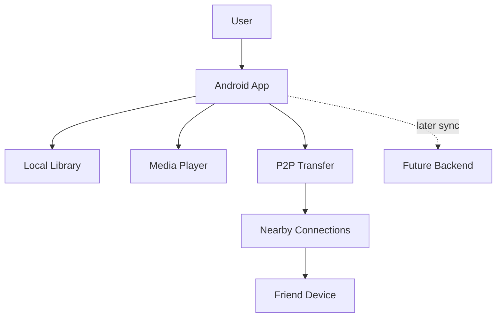
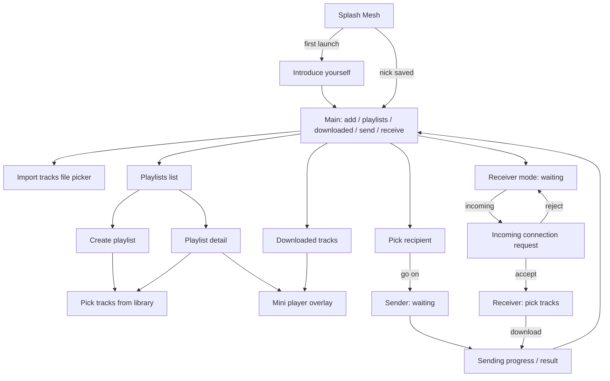
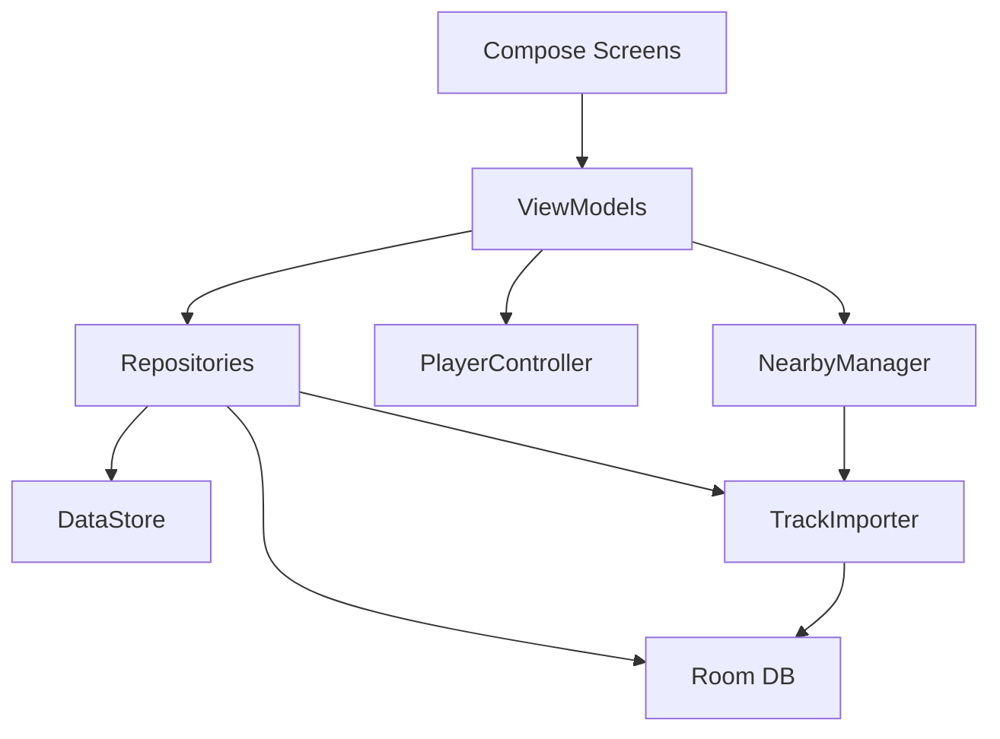

# План Music Mesh MVP

## Идея и фокус

Проект начинается не как полноценный музыкальный сервис, а как мобильное приложение для личной библиотеки и обмена треками между знакомыми устройствами. Пользователь сам добавляет аудиофайлы, слушает их локально и вручную делится выбранными треками с друзьями рядом.

Главная гипотеза MVP: обмен музыкой между телефонами должен быть проще и приятнее, чем отправка файла через мессенджер, особенно когда люди находятся рядом.

## Решения на старт

- Платформа первой версии: Android.
- Основной стек: Kotlin, Jetpack Compose, AndroidX Media3/ExoPlayer, Room.
- P2P-технология для первого прототипа: Nearby Connections API.
- Контент: только файлы, добавленные пользователем вручную.
- Онлайн-режим: проектировать как будущий слой, но не строить полноценный backend в первой версии.
- Тестирование: сразу на двух реальных Android-устройствах.

## Первый вертикальный MVP

Цель первого MVP - пройти полный путь одного трека от добавления до выбора получателем, загрузки и прослушивания на другом телефоне.

MVP должен уметь:

- выбрать аудиофайл через системный file picker;
- добавить файл в локальную библиотеку приложения;
- прочитать минимальные метаданные: имя, размер, длительность, MIME/type;
- проиграть локальный трек;
- обнаружить второй телефон рядом;
- установить временное соединение с выбранным устройством;
- показать получателю список доступных треков отправителя;
- дать получателю выбрать один или несколько треков для загрузки;
- сохранить принятый трек в локальную библиотеку;
- проиграть полученный трек;
- показать статус передачи: ожидание, передача, готово, ошибка;
- дать обеим сторонам разорвать соединение.

В первую версию не включать:

- публичную раздачу треков незнакомым пользователям;
- аккаунты и социальную сеть;
- облачное хранение музыки;
- рекомендации, ленту, лайки и комментарии;
- монетизацию;
- DRM и сложную правовую модель.

## Предлагаемая архитектура




## UX Flow первого MVP

### Первый запуск

- Пользователь вводит ник.
- Авторизации, аккаунтов и паролей в тестовом MVP нет.
- Ник используется для отображения устройства в локальном поиске.

### Главный экран

- Кнопки: `playlists`, `downloaded`, `send`, `receive`, `add`.
- `add` открывает системный file picker для импорта аудиофайлов.
- Сразу содержит плейлист `Любимое`.
- Позволяет создавать пользовательские плейлисты через экран `create playlist`.
- На всех экранах с треками внизу показывается мини-плеер при воспроизведении.

### Установка соединения

- Получатель нажимает `Receive` и переходит в режим получения (устройство становится видимым для Nearby discovery).
- Отправитель нажимает `Send`.
- Открывается экран поиска получателей рядом (видны только те, кто сейчас в режиме `Receive`).
- Найденные устройства отображаются простым списком ников.
- В первом MVP отправитель выбирает одного получателя (UI не должен мешать будущей поддержке нескольких).
- Отправитель нажимает `go on` для установки соединения.
- Получатель видит запрос на соединение от ника отправителя и принимает или отклоняет.

### Выбор и загрузка треков

- После принятия соединения получатель видит список треков отправителя.
- Получатель сам выбирает, какие треки скачать.
- Получатель нажимает кнопку загрузки или подтверждения.
- Треки передаются с устройства отправителя на устройство получателя.
- Полученные треки попадают в общую библиотеку получателя.

### Прогресс, отмена и разрыв соединения

- У отправителя и получателя отображается прогресс передачи в процентах.
- У обеих сторон всегда доступна кнопка `Разорвать соединение`.
- Если соединение разорвано во время передачи, уже полностью полученные треки остаются у получателя.
- Частично полученный незавершенный файл не добавляется в библиотеку как трек.
- Дубликаты обрабатываются после нажатия `download`: треки, которые уже есть у получателя, просто не скачиваются; на экране `Sending` показывается сообщение вроде «N tracks skipped (already in library)».

## Экраны MVP

### Навигация




### 1. Приветствие (Splash)

- **Открывается:** при каждом запуске приложения.
- **Видит:** тёмный фон, логотип `Mesh`.
- **Состояния:**
  - показ splash ~2 секунды при каждом запуске;
  - автопереход на авторизацию (ник не сохранён) или на основной экран (ник есть).

### 2. Авторизация (ввод ника)

- **Открывается:** после первого запуска.
- **Видит:** `Introduce yourself`, поле ника, кнопка `Done`.
- **Действия:** ввод ника; `Done` при непустом поле → основной экран.
- **Состояния:** `Done` неактивна без текста; активна при наличии текста.

### 3. Основной экран

- **Открывается:** после входа / при повторном запуске.
- **Видит:** кнопки `add`, `playlists`, `downloaded`, `send`, `receive`.
- **Действия:**
  - `add` → импорт треков через file picker;
  - `playlists` → список плейлистов;
  - `downloaded` → все скачанные треки;
  - `send` → поиск получателей.
  - `receive` → режим получения (ожидание входящих запросов).

### 3a. Загрузка треков (Import)

- **Открывается:** с основного экрана по `add`.
- **Видит:** системное окно хранилища устройства для выбора аудиофайлов подходящих форматов.
- **Действия:** пользователь выбирает один или несколько MP3-файлов; после выбора файлы копируются в sandbox приложения и появляются в `downloaded`.
- **Ошибки:** после завершения импорта (успехи + неуспехи) показывается модальное окно по центру экрана со списком файлов, которые не удалось добавить, и кнопкой `OK`.

### 4. Плейлисты

- **Открывается:** с основного экрана.
- **Видит:** список плейлистов (простые контейнеры без обложек), `create`, `back`.
- **Действия:** тап по плейлисту → экран плейлиста; `create` → экран создания плейлиста.
- **Состояния:** начальное — только плейлист `Любимое` (системный, не удаляется).

### 5. Скачанное (Downloaded)

- **Открывается:** с основного экрана.
- **Видит:** `back`, список треков.
- **Действия на трек:** добавить в плейлист (список плейлистов с галочками), удалить с устройства.
- **Состояния:** пустой список при первом запуске.

### 6. Отправление (выбор получателя)

- **Открывается:** с основного экрана по `send`.
- **Видит:** список пользователей рядом (только тех, кто открыл `receive`), `go on`, `back`.
- **Действия:** выбор одного пользователя (в MVP максимум 1); `go on` → установка соединения и экран ожидания у отправителя.
- **Состояния:** `go on` неактивна без выбора; активна при выбранном пользователе.

### 6a. Получение (режим ожидания у получателя)

- **Открывается:** с основного экрана по `receive`.
- **Видит:** экран “Ready to receive”, индикатор ожидания, `back` (выход из режима получения).
- **Поведение:** пока экран открыт, устройство рекламируется в Nearby и может принимать входящие запросы соединения. При выходе с экрана режим получения выключается и устройство больше не видно отправителям.

### 7. Входящий запрос соединения

- **Открывается:** у получателя, когда отправитель нажал `go on`, и получатель находится на экране `receive`.
- **Видит:** ник отправителя, `Accept`, `Reject`.
- **Действия:** принять → экран выбора треков; отклонить → экран `receive`.

### 8. Плейлист (детальный)

- **Открывается:** из списка плейлистов.
- **Видит:** название, список треков, `back`, `add`, `delete`.
- **Действия:**
  - `delete` → удалить плейлист;
  - `add` → добавить треки в плейлист;
  - `back` → список плейлистов;
  - на трек: удалить из плейлиста, удалить с устройства.

### 9. Ожидание у отправителя

- **Открывается:** после `go on` на экране отправления.
- **Видит:** `Please wait, receiver is choosing tracks`, `close connection`.
- **Действия:** разорвать соединение.

### 10. Выбор треков у получателя

- **Открывается:** после принятия запроса на соединение.
- **Видит:** список треков отправителя, `close connection`, `download`.
- **Действия:** выбор треков (галочка/подсветка); `download` → передача; `close connection` → разрыв.
- **Состояния:** `download` неактивна без выбора; активна при выбранных треках.

### 11. Sending (передача / результат)

- **Открывается:** когда получатель нажал `download`.
- **Видит (состояние 1 — передача):** прогресс по полностью отправленным трекам (например, `3/7 tracks sent`) у обеих сторон, `close connection`.
- **Видит (состояние 2 — успех):** `Success! Enjoy your music`, `continue listening`.
- **Видит (состояние 3 — прервано):** `Connection closed, XX% of tracks was downloaded`, `continue listening`.
- **Действия:** `close connection` → прервать; `continue listening` → основной экран.
- **Дубликаты:** после `download` треки, уже имеющиеся у получателя, пропускаются; на экране результата показывается «N tracks skipped (already in library)».

### 12. Create playlist

- **Открывается:** по `create` на экране плейлистов.
- **Видит:** поле названия (`Type header` или аналог), `back`, `add`, `done`.
- **Действия:**
  - ввод названия;
  - `back` → список плейлистов;
  - `add` → экран выбора треков из библиотеки;
  - `done` → плейлист создаётся (минимум с названием).
- **Состояния:** `done` неактивна без названия; активна при наличии названия.

### 13. Выбор треков из библиотеки (Add to playlist)

- **Открывается:** с экрана `create playlist` или `add` внутри плейлиста.
- **Видит:** список треков из `downloaded`, `back`, `done`.
- **Действия:** выбор треков (галочка/подсветка); `done` → добавить выбранные в плейлист; `back` → назад.
- **Состояния:** `done` неактивна без выбора; активна при выбранных треках.

### 14. Мини-плеер (overlay)

- **Появляется:** на всех экранах со списком треков после тапа по треку.
- **Видит:** обложка (или placeholder), название трека, `назад`, `play/pause`, `вперёд`.
- **Действия:** управление воспроизведением; не блокирует навигацию по приложению.

## Решения по данным и контенту

- **Форматы MVP:** только MP3.
- **Хранение:** копировать импортированные файлы в sandbox приложения.
- **Плейлист `Любимое`:** системный, не удаляется.
- **Добавить в плейлист:** bottom sheet / список плейлистов с галочками.
- **Дубликаты при download:** пропускать автоматически + сообщение на экране результата.

## Модули приложения

- `ui`: экраны, навигация, состояния интерфейса.
- `library`: импорт файлов, локальная библиотека, чтение метаданных.
- `player`: проигрывание через Media3/ExoPlayer.
- `transfer`: discovery, подключение, каталог доступных треков, загрузка, прогресс.
- `device`: имя устройства, локальный ID, информация о peers.
- `storage`: работа с URI/файлами и правилами хранения.

На старте не нужно строить сложную clean architecture. Достаточно разделить код по смысловым модулям, чтобы P2P, плеер и библиотека не смешались в одном месте.

## Основные сущности

- `Track`: ID, название, артист при наличии, длительность, размер, MIME/type, хэш файла.
- `LocalFile`: URI или путь к локальной копии, источник, дата добавления.
- `Device`: локальный ID, отображаемое имя, статус доступности.
- `Transfer`: track ID, отправитель, получатель, прогресс, статус, ошибка.
- `ConnectionRequest`: запрос на временное соединение между двумя устройствами.
- `RemoteTrack`: краткое описание трека отправителя, доступное получателю для выбора.
- `DownloadRequest`: выбор получателя, какие треки скачать с подключенного устройства.

Хэш файла стоит добавить рано: он поможет избежать дублей и проверять, что файл передался целиком.

## Roadmap

### Этап 1: Локальная библиотека и плеер

- Создать Android-проект.
- Сделать экран библиотеки.
- Добавить выбор аудиофайла.
- Сохранить запись о треке в Room.
- Настроить проигрывание через Media3.

Результат: один телефон может импортировать и проигрывать треки.

### Этап 2: P2P discovery

- Подключить Nearby Connections.
- Сделать режим поиска устройств.
- Сделать режим видимости устройства.
- Показать найденные устройства в UI.
- Добавить запрос на установку соединения между двумя никами.

Результат: два телефона видят друг друга рядом и могут установить временное соединение.

### Этап 3: Просмотр каталога и загрузка

- Передать получателю список доступных треков отправителя.
- Дать получателю выбрать один или несколько треков.
- Скачать выбранные треки на устройство получателя.
- Показать прогресс передачи.
- Сохранить файл на принимающем устройстве.

Результат: получатель сам выбирает и скачивает треки с подключенного устройства.

### Этап 4: Интеграция MVP

- Добавить принятый файл в библиотеку.
- Проверять дубли по хэшу и пропускать с сообщением на экране результата.
- Обрабатывать ошибки: отмена, потеря соединения, нехватка места.
- Реализовать разрыв соединения с обеих сторон.
- Улучшить UX статусов.

Результат: полный сценарий “добавил -> подключился -> выбрал -> скачал -> слушаю”.

### Этап 5: Подготовка к онлайн-режиму

- Описать модель аккаунта и устройств.
- Решить, нужен ли backend для дружбы, синхронизации и relay-передач.
- Не переносить хранение треков в облако, пока локальный сценарий не доказан.

Результат: понятная граница между локальным P2P-приложением и будущим онлайн-сервисом.

## Ключевые риски

- P2P на телефонах может вести себя нестабильно из-за permissions, battery restrictions и особенностей устройств.
- Пользовательский сценарий должен быть проще, чем отправка файла в мессенджере.
- Нужно явно ограничить обмен файлами: только ручное действие пользователя и только знакомые устройства.
- Большие аудиофайлы требуют понятной политики хранения, удаления и проверки свободного места.
- Юридически нельзя превращать MVP в публичную сеть распространения чужого контента.

## Техническая архитектура

### Принципы

- Один Android-модуль, без multi-module на старте.
- Single Activity + Jetpack Navigation Compose.
- UI: Compose + ViewModel + StateFlow.
- Данные: Room для треков/плейлистов, DataStore для ника и device ID.
- P2P и playback — отдельные классы-сервисы, не смешивать с UI.

### Структура пакетов

```text
com.mesh.app
├── MeshApplication.kt          # инициализация DI/синглтонов
├── MainActivity.kt             # единственная activity, NavHost
├── ui/
│   ├── navigation/             # routes, NavGraph
│   ├── theme/                  # цвета, типографика
│   ├── components/             # MiniPlayer, TrackRow, PlaylistRow
│   ├── splash/
│   ├── auth/
│   ├── home/
│   ├── downloaded/
│   ├── playlists/
│   ├── playlist/
│   ├── createplaylist/
│   ├── picktracks/
│   ├── send/
│   ├── connection/
│   ├── transfer/             # sender wait, receiver pick, sending
│   └── addtoplaylist/        # bottom sheet
├── data/
│   ├── local/
│   │   ├── entity/             # Room entities
│   │   ├── dao/
│   │   └── MeshDatabase.kt
│   ├── prefs/UserPrefs.kt      # DataStore: nickname, deviceId
│   └── repository/
│       ├── TrackRepository.kt
│       └── PlaylistRepository.kt
├── library/
│   ├── TrackImporter.kt        # URI -> copy to sandbox -> metadata
│   └── MetadataReader.kt       # MediaMetadataRetriever
├── player/
│   ├── PlayerController.kt     # обёртка над Media3 ExoPlayer
│   └── PlayerState.kt
├── transfer/
│   ├── NearbyManager.kt        # discovery, connect, send/receive bytes
│   ├── TransferProtocol.kt     # JSON-сообщения между устройствами
│   └── TransferState.kt        # in-memory состояние сессии
└── util/
    ├── FileHasher.kt           # SHA-256 для дедупликации
    └── PermissionsHelper.kt
```

### Слои и поток данных




Экран не обращается к Room или Nearby напрямую — только через ViewModel и Repository.

### Room-схема

**tracks**


| колонка     | тип         | описание                 |
| ----------- | ----------- | ------------------------ |
| id          | TEXT PK     | UUID                     |
| title       | TEXT        | название                 |
| artist      | TEXT?       | артист из ID3 или null   |
| duration_ms | LONG        | длительность             |
| file_size   | LONG        | размер в байтах          |
| file_hash   | TEXT UNIQUE | SHA-256 для дедупликации |
| local_path  | TEXT        | путь в sandbox           |
| source      | TEXT        | `import` или `p2p`       |
| added_at    | LONG        | timestamp                |


**playlists**


| колонка    | тип     | описание           |
| ---------- | ------- | ------------------ |
| id         | TEXT PK | UUID               |
| name       | TEXT    | название           |
| is_system  | BOOLEAN | true для `Любимое` |
| created_at | LONG    | timestamp          |


**playlist_tracks** (many-to-many)


| колонка     | тип     | описание            |
| ----------- | ------- | ------------------- |
| playlist_id | TEXT FK | → playlists.id      |
| track_id    | TEXT FK | → tracks.id         |
| position    | INT     | порядок в плейлисте |


PK: `(playlist_id, track_id)`.

При первом запуске создаётся системный плейлист `Любимое` (`is_system = true`).

### DataStore (не Room)

- `nickname: String?` — ник пользователя.
- `device_id: String` — UUID устройства, генерируется один раз.

### Хранение файлов

```text
/data/data/com.mesh.app/files/tracks/{trackId}.mp3
```

При импорте:

1. Пользователь выбирает MP3 через Storage Access Framework.
2. `TrackImporter` копирует файл в sandbox.
3. Считается SHA-256.
4. Если hash уже есть в БД — копия удаляется, дубликат не создаётся.
5. Иначе — запись в `tracks`.

При удалении трека: удалить файл с диска + строку в БД + связи в `playlist_tracks`.

### State management

Каждый экран — свой ViewModel с `StateFlow<UiState>`:

```kotlin
// пример
data class DownloadedUiState(
    val tracks: List<TrackUi> = emptyList(),
    val isLoading: Boolean = false,
)
```

UI подписывается через `collectAsStateWithLifecycle()`.

**Глобальное состояние (2 синглтона):**

- `PlayerController` — текущий трек, play/pause, queue, next/prev.
- `NearbyManager` / `TransferSession` — discovery, connection, progress.

Mini-player читает `PlayerController.playerState` на любом экране.

### Player (Media3)

- Один `ExoPlayer` на всё приложение (singleton через `PlayerController`).
- Тап по треку → `playerController.play(track)`.
- Mini-player: `prev` / `playPause` / `next` по текущей очереди (плейлист или downloaded list).
- Обложка: из ID3 через `MediaMetadataRetriever`, иначе placeholder.

### P2P (Nearby Connections)

**Роли:**

- Получатель: `advertise` (только пока открыт экран `receive`) + `accept connection`.
- Отправитель: `discover` + `connection initiator`.

**Протокол сообщений (JSON через Nearby payload):**


| тип                            | направление | содержимое                                         |
| ------------------------------ | ----------- | -------------------------------------------------- |
| `CONNECTION_REQUEST`           | → receiver  | nickname отправителя                               |
| `CONNECTION_ACCEPT` / `REJECT` | → sender    |                                                    |
| `TRACK_LIST`                   | → receiver  | массив `{id, title, artist, duration, size, hash}` |
| `DOWNLOAD_REQUEST`             | → sender    | массив track IDs                                   |
| `FILE_CHUNK` / `FILE_COMPLETE` | → receiver  | байты MP3 + metadata                               |
| `TRANSFER_PROGRESS`            | ↔ both      | процент                                            |
| `DISCONNECT`                   | ↔ both      |                                                    |


**Transfer state (in-memory, не Room):**

```kotlin
sealed class TransferPhase {
    Idle, Discovering, Connecting, WaitingForPick,
    Transferring(progress: Int), Success, PartialSuccess, Failed
}
```

Дубликаты: получатель шлёт `DOWNLOAD_REQUEST`; перед приёмом каждого файла sender/receiver проверяет hash — если есть в БД, трек пропускается, счётчик `skipped` увеличивается.

### Navigation (routes)

```text
splash → auth? → home
home → downloaded | playlists | send | (file picker)
playlists → create_playlist | playlist/{id}
create_playlist → pick_tracks
playlist/{id} → pick_tracks
send → sender_wait → sending
(connection request overlay) → receiver_pick → sending
```

Incoming connection request — overlay/dialog поверх текущего экрана, не отдельный route (или full-screen dialog destination).

### Permissions


| permission                                                   | зачем                                          |
| ------------------------------------------------------------ | ---------------------------------------------- |
| `READ_MEDIA_AUDIO` (API 33+)                                 | выбор MP3                                      |
| `READ_EXTERNAL_STORAGE` (API ≤32)                            | выбор MP3 на старых Android                    |
| `ACCESS_FINE_LOCATION`                                       | требуется для Wi-Fi discovery в Nearby         |
| `BLUETOOTH`, `BLUETOOTH_CONNECT`, `BLUETOOTH_SCAN` (API 31+) | Nearby Connections                             |
| `NEARBY_WIFI_DEVICES` (API 33+)                              | Nearby без location на новых API               |
| `POST_NOTIFICATIONS` (API 33+)                               | опционально: входящий запрос соединения в фоне |


Запрашивать permissions только когда нужны: storage при `add`, nearby при `send`, location вместе с nearby.

### Зависимости (Gradle)

- Compose BOM + Material3
- Navigation Compose
- Room + KSP
- DataStore Preferences
- Media3 ExoPlayer
- Google Play Services: Nearby Connections
- Coroutines + Lifecycle ViewModel

### SDK версии

- `minSdk = 26` (Android 8.0)
- `targetSdk = 34` или `35`

### Порядок реализации (Этап 1 детально)

1. Scaffold проекта: theme, navigation, DataStore, Room, пустые экраны.
2. Splash + Auth + Home (навигация работает).
3. TrackImporter + Downloaded screen.
4. PlayerController + MiniPlayer.
5. Playlists + Favorites seed + Create playlist + Pick tracks.
6. Add to playlist bottom sheet.
7. Только после этого — Этап 2 (Nearby).

## Следующие шаги

Этапы 1–3 реализованы. Этап 4 реализован в коде и требует приёмки на двух реальных телефонах по `docs/STAGE4_TESTING.md`.

Ближайшая последовательность:

1. Сохранить рабочую версию этапов 1–3 в GitHub отдельной веткой.
2. Завершить обработку отмены, ошибок хранения и передачи в этапе 4; проверить сборку и unit-тесты.
3. Прогнать сценарии этапа 4 на двух телефонах, зафиксировать результаты и слить проверенные изменения в `main`.
4. Сделать отдельную дизайн-итерацию после предоставления макета Figma пользователем; до этого дизайн не менять.
5. Обсудить этап 5: границы онлайн-режима и модель аккаунта/устройств. Реализацию backend не начинать без отдельного решения.
