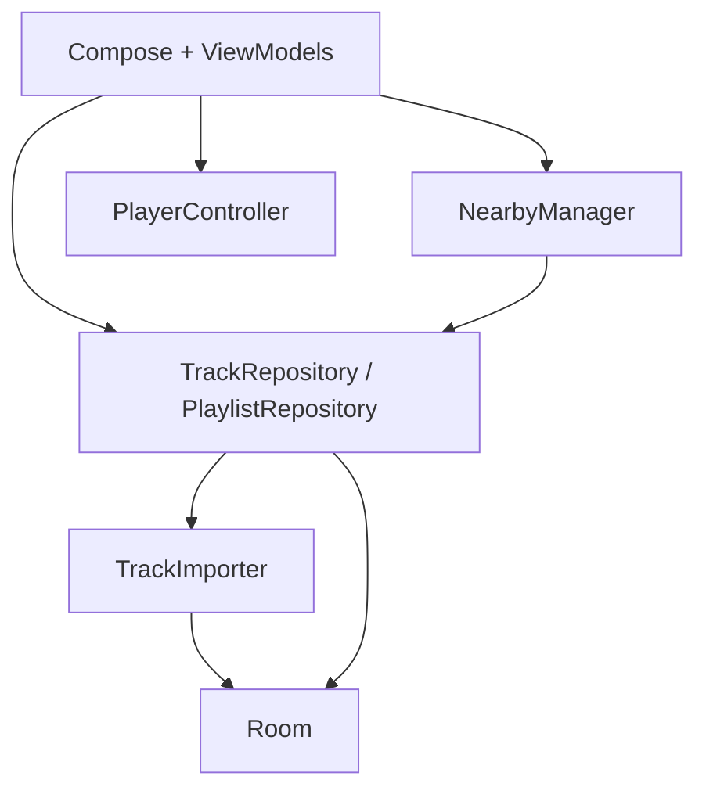

# Music Mesh

Android-приложение: локальная библиотека MP3 и обмен треками рядом через Nearby Connections.

Спека MVP: [`Music Mesh MVP.md`](Music%20Mesh%20MVP.md)

## Быстрый старт

1. Открой папку `music-mesh` в Android Studio (Ladybug+).
2. Sync Gradle.
3. Запуск на **реальном** устройстве API 26+ (Nearby на эмуляторах почти бесполезен).

CLI:

```bash
./gradlew assembleDebug
./gradlew testDebugUnitTest
```

Нужны JDK 17 (выбранный в `JAVA_HOME` / настройках Gradle в Android Studio) и Android SDK (compile/target 35).
Путь к JDK конкретного компьютера в проекте не закрепляется.

Правила коммитов и веток: [CONTRIBUTING.md](CONTRIBUTING.md).
GitHub Actions собирает debug APK и запускает unit-тесты при push рабочих веток и в PR.
APK и отчёты доступны в артефактах успешного запуска Actions, хранятся 7 дней и не попадают в Git.

## Для разработчиков

Перед правками **не сканируй весь проект**. Читай локальные правила раздела:

| Файл                                            | Раздел                              |
| ----------------------------------------------- | ----------------------------------- |
| `app/src/main/java/com/mesh/app/RULES.local.md` | Корень модуля, DI, stages           |
| `.../transfer/RULES.local.md`                   | Nearby, протокол, каталог, download |
| `.../library/RULES.local.md`                    | Импорт MP3, hash, P2P save          |
| `.../data/RULES.local.md`                       | Room, DataStore, repositories       |
| `.../player/RULES.local.md`                     | ExoPlayer / MiniPlayer              |
| `.../ui/RULES.local.md`                         | Экраны и навигация Stage 3          |
| `.../util/RULES.local.md`                       | Permissions, hasher, formatters     |

Файлы `RULES.local.md` в **`.gitignore`** (локальный контекст). Если их нет после clone — восстанови по этой таблице или уточни правила у сопровождающего проекта.

## Структура пакетов

```text
com.mesh.app
├── MeshApplication.kt      # синглтоны + ViewModelFactory
├── MainActivity.kt
├── transfer/               # NearbyManager, protocol, session state
├── library/                # TrackImporter, MetadataReader
├── data/
│   ├── local/              # Room
│   ├── model/
│   ├── prefs/              # nickname, deviceId
│   └── repository/
├── player/                 # PlayerController
├── util/
└── ui/
    ├── navigation/         # Routes, MeshNavGraph
    ├── send/ receive/      # discovery + connect
    ├── transfer/           # wait / pick / progress (Stage 3)
    ├── downloaded/ playlists/ ...
    └── components/
```

## Архитектура (кратко)



UI не ходит в Nearby/Room напрямую — только через ViewModel и сервисы из `MeshApplication`.

## Stages

### Stage 1 — готово

Локальная библиотека, импорт MP3, плеер, плейлисты, Favorites.

### Stage 2 — готово

Nearby discovery/advertise, Accept/Reject, соединение 1:1.

### Stage 3 — готово

После Accept:

1. Sender шлёт `TRACK_LIST`.
2. Receiver выбирает треки → `DOWNLOAD_REQUEST`.
3. Sender шлёт `FILE_OFFER` + file payload по очереди.
4. Receiver после SUCCESS импортирует в sandbox + Room (`source=p2p`), дубли по SHA-256 пропускаются.
5. Обе стороны видят прогресс и итог (Success / PartialSuccess).

Навигация:

```text
Send → sender_wait → transfer_progress → Home
Receive → receiver_pick → transfer_progress → Home
```

### Stage 4 — реализован; приёмка на двух телефонах ещё нужна

Принятые файлы добавляются в библиотеку только после завершения FILE payload, проверки размера и SHA-256.
Дубли пропускаются и отражаются в результате обеих сторон; параллельные импорты сериализованы.

- Отмена и потеря соединения сохраняют завершённые треки; незавершённые файлы очищаются и не добавляются в Room.
- Отправитель явно сообщает о файлах, которые не смог отправить: получатель не ждёт несуществующий payload.
- Успех у отправителя появляется после `TRANSFER_RESULT` — подтверждения сохранения получателем.
- Повторные/поздние callbacks не увеличивают счётчики повторно и не возвращают завершённый сеанс к прогрессу.
- Проверяется свободное место с учётом временных копий и резерва 16 MiB; копирование ограничено размером/бюджетом.
- Зависшее подключение, получение каталога или передача завершаются понятной ошибкой после 120 секунд без прогресса. Время ручного выбора треков не ограничено.
- После отмены остаётся экран результата. Для отправителя различаются «отправлено» и «сохранение подтверждено».

Протокол теперь версии 2: **обновить приложение на обоих телефонах**. Версия 1 несовместима.
Большие каталоги пока не разбиваются на части: превышение лимита BYTES Nearby даёт явную ошибку.
Фоновая передача при выгрузке процесса, автоматическое возобновление и онлайн-режим не добавлены.
Дизайн не перерабатывался: изменения интерфейса ограничены поведением отмены и текстами статусов.

План приёмки и ограничения проверок: [docs/STAGE4_TESTING.md](docs/STAGE4_TESTING.md).

## Ручной тест Stage 3 (2 телефона)

1. На A импортируй несколько MP3, открой **Send**.
2. На B открой **Receive**, Accept.
3. На B выбери треки → **Download**.
4. Прогресс на обеих сторонах → Continue listening.
5. На B треки в **Downloaded**, воспроизводятся.
6. Повтор той же передачи → skipped duplicates.
7. Обрыв на втором файле → первый остаётся, partial не в библиотеке.

## Зависимости

Compose Material3, Navigation, Room+KSP, DataStore, Media3, Play Services Nearby, Coroutines. Версии — `gradle/libs.versions.toml`.
