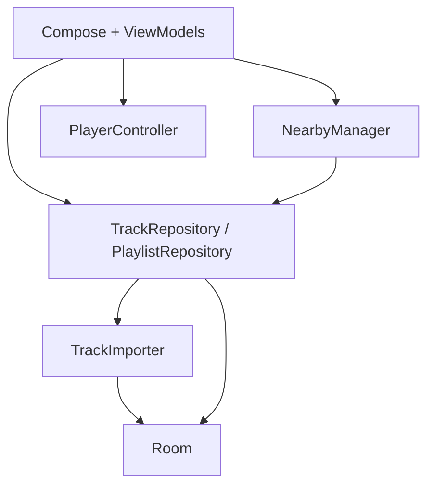

# Music Mesh

Android-приложение: локальная библиотека MP3 и обмен треками рядом через Nearby Connections.

Спека MVP: [`../Music Mesh MVP.md`](../Music%20Mesh%20MVP.md)

## Быстрый старт

1. Открой папку `music-mesh` в Android Studio (Ladybug+).
2. Sync Gradle.
3. Запуск на **реальном** устройстве API 26+ (Nearby на эмуляторах почти бесполезен).

CLI:

```bash
./gradlew assembleDebug
./gradlew testDebugUnitTest
```

Нужны JDK 17 и Android SDK (compile/target 35).

## Для агентов / разработчиков

Перед правками **не сканируй весь проект**. Читай локальные правила раздела:

| Файл | Раздел |
|------|--------|
| `app/src/main/java/com/mesh/app/RULES.local.md` | Корень модуля, DI, stages |
| `.../transfer/RULES.local.md` | Nearby, протокол, каталог, download |
| `.../library/RULES.local.md` | Импорт MP3, hash, P2P save |
| `.../data/RULES.local.md` | Room, DataStore, repositories |
| `.../player/RULES.local.md` | ExoPlayer / MiniPlayer |
| `.../ui/RULES.local.md` | Экраны и навигация Stage 3 |
| `.../util/RULES.local.md` | Permissions, hasher, formatters |

Файлы `RULES.local.md` в **`.gitignore`** (локальный контекст). Если их нет после clone — восстанови по этой таблице / спроси у агента.

## Структура пакетов

```text
com.mesh.app
├── MeshApplication.kt      # синглтоны + ViewModelFactory
├── MainActivity.kt
├── transfer/               # NearbyManager, protocol, session state
├── library/                # TrackImporter, MetadataReader
├── data/
│   ├── local/              # Room
│   ├── model/
│   ├── prefs/              # nickname, deviceId
│   └── repository/
├── player/                 # PlayerController
├── util/
└── ui/
    ├── navigation/         # Routes, MeshNavGraph
    ├── send/ receive/      # discovery + connect
    ├── transfer/           # wait / pick / progress (Stage 3)
    ├── downloaded/ playlists/ ...
    └── components/
```

## Архитектура (кратко)



UI не ходит в Nearby/Room напрямую — только через ViewModel и сервисы из `MeshApplication`.

## Stages

### Stage 1 — готово
Локальная библиотека, импорт MP3, плеер, плейлисты, Favorites.

### Stage 2 — готово
Nearby discovery/advertise, Accept/Reject, соединение 1:1.

### Stage 3 — готово (текущий)
После Accept:
1. Sender шлёт `TRACK_LIST`.
2. Receiver выбирает треки → `DOWNLOAD_REQUEST`.
3. Sender шлёт `FILE_OFFER` + file payload по очереди.
4. Receiver после SUCCESS импортирует в sandbox + Room (`source=p2p`), дубли по SHA-256 пропускаются.
5. Обе стороны видят прогресс и итог (Success / PartialSuccess).

Навигация:

```text
Send → sender_wait → transfer_progress → Home
Receive → receiver_pick → transfer_progress → Home
```

### Stage 4 — дальше
Полировка ошибок (диск, cancel mid-file), UX статусов.

## Ручной тест Stage 3 (2 телефона)

1. На A импортируй несколько MP3, открой **Send**.
2. На B открой **Receive**, Accept.
3. На B выбери треки → **Download**.
4. Прогресс на обеих сторонах → Continue listening.
5. На B треки в **Downloaded**, воспроизводятся.
6. Повтор той же передачи → skipped duplicates.
7. Обрыв на втором файле → первый остаётся, partial не в библиотеке.

## Зависимости

Compose Material3, Navigation, Room+KSP, DataStore, Media3, Play Services Nearby, Coroutines. Версии — `gradle/libs.versions.toml`.
